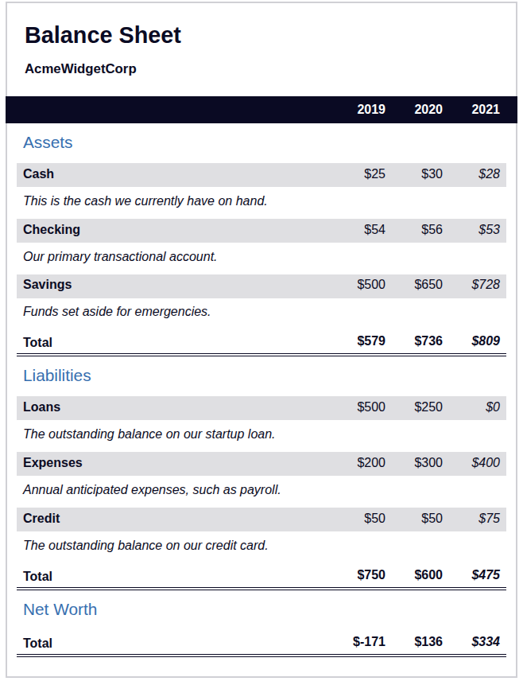

# 📊 Balance Sheet - Muzammil Mirza

This is a responsive balance sheet project built as part of the **freeCodeCamp Responsive Web Design Certification**. The design showcases a clean layout of assets, liabilities, and net worth over three years.

## 🔍 About the Project

This project replicates a financial balance sheet interface, presenting data in a readable and visually structured format using only **HTML** and **CSS**.

Features:
- Displays Assets, Liabilities, and Net Worth for 2019–2021.
- Semantic HTML5 elements for accessibility.
- Custom-styled sticky year header.
- Clear visual formatting using CSS.

## 🛠️ Built With

- HTML5 (semantic, accessible structure)
- CSS3 (flexbox, gradients, hover effects)

## 🚀 Live Demo

[🔗 View the live project on GitHub Pages](https://mozumil.github.io/Balance-Sheet/)

## 🖼️ Screenshot

## 📁 Project Structure

balance-sheet/
├── index.html
├── styles.css
└── README.md
└── ScreenShot.png

## 👤 Author

**Muzammil Mirza** — **X.com** - [@hiMuzammil](https://x.com/hiMuzammil)

## 📜 License

This project is free to use for learning and educational purposes.

---
